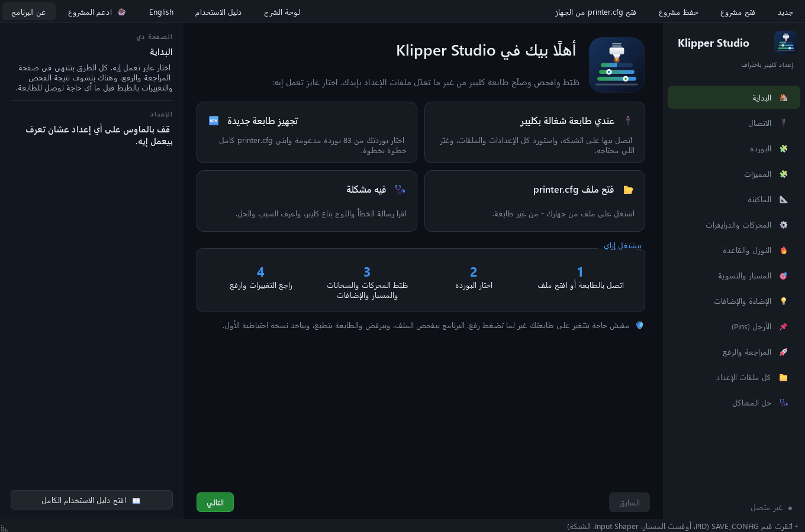

<div dir="rtl">

<div align="center">


# ATGENX Klipper Studio

**برنامج على الكمبيوتر بيبني ملف `printer.cfg` لكليبر، ويفحصه، ويرفعه على الطابعة بأمان، من غير ما يبوّظ الموجود عندك.**

[English](README.md) · [دليل الاستخدام](docs/GUIDE.ar.md) · [البوردات المدعومة](docs/BOARDS.md) · [المساهمة](CONTRIBUTING.md)



</div>

> **نسخة تجريبية (Beta):** شغالة على طابعات حقيقية، بس دايمًا راجع تبويب «الفروق» قبل الرفع.
> كل رفع بيعمل نسخة احتياطية الأول، والبرنامج بيرفض يلمس طابعة بتطبع.

## ليه البرنامج ده؟

تعديل `printer.cfg` بإيدك معناه إنك تنقل الأرجل من ملف البورده، وتفتكر أنهي قسم بيغطي على التاني، وتتمنى إن `SAVE_CONFIG`
ما يلغيش القيمة اللي لسه مغيرها. غلطة واحدة وكليبر مش هيشتغل.

البرنامج بيمشي معاك صفحة صفحة، ويولّد الإعداد المناسب لبوردتك، و**يدمجه في ملفك الحالي سطر بسطر** (الماكروهات والتعليقات
والتنسيق بتاعك بيفضلوا زي ما هما)، ويوريك بالظبط إيه اللي هيتغير، ويفحص الأخطاء المشهورة، ويرفع الملف عن طريق Moonraker بعد ما ياخد نسخة احتياطية.

## المميزات

- **83 بوردة تحكم:** BIGTREETECH وFYSETC وMakerbase وMellow وCreality وDuet وLDO وPrusa وRAMPS وغيرهم، مأخوذين من ملفات كليبر الرسمية.
  تختار بوردتك وكل الأرجل ومسارات UART/SPI للدرايفرات والأقسام المطلوبة بتتملى لوحدها. وكمان بيوريك ملخص إعدادات
  *make menuconfig* (المعالج، الـ bootloader، الكريستالة، طريقة الاتصال).
- **استيراد من طابعة شغالة:**
  - بيتصل بـ Moonraker مباشرة (من غير SSH ولا باسوردات).
  - بيحمّل `printer.cfg` **وكل الملفات المتضمنة فيه**.
  - بيقرا قيم `SAVE_CONFIG` (الـ PID، أوفست المسبار، الـ Input Shaper).
  - بيتعرف على البورده من الأرجل.
- **دمج ذكي:**
  - بيعيد كتابة القيم اللي اتغيرت فعلًا بس. أي حاجة تانية بتفضل بنفس السطر والتعليق وتنسيق الأرقام.
  - الماكروهات والإضافات بتاعتك ما بتتلمسش.
  - القيم اللي البرنامج بقى بيكتبها بتتشال من بلوك `SAVE_CONFIG` عشان تاخد مفعولها.
- **فحص قبل الرفع:** أرجل ناقصة أو مكررة، سيريال مش متظبط، `max_z_accel` أكبر من `max_accel`، منطقة شبكة فاضية، مسار TMC غلط،
  ماكروهات بتستخدم حاجة انت قفلتها، أقسام مكررة في ملفات متضمنة، وتحذيرات كليبر نفسه.
- **رفع آمن:**
  - بيرفض والطابعة بتطبع أو متوقفة مؤقتًا.
  - بيرفض لو الملف اتغير على الطابعة من وقت ما حمّلته.
  - بياخد نسخة احتياطية على الطابعة وعلى جهازك قبل الرفع.
  - بيعمل `FIRMWARE_RESTART` ويستنى كليبر، ولو حصلت مشكلة ترجع النسخة بضغطة واحدة.
- **كل ملفات الإعداد:** تتصفح كل ملفات الطابعة كشجرة: `moonraker.conf` و`crowsnest.conf` وKlipperScreen والإضافات.
  تضغط على أي قسم تروح له، وتعدّل وتحفظ بنفس قواعد الأمان، والبرنامج بيعيد تشغيل الخدمة اللي الملف محتاجها بس.
- **الماكينة كلها:**
  - Cartesian وCoreXY.
  - من 2 لـ 4 محركات Z مع `z_tilt` أو `quad_gantry_level` (نقط القياس بتتحسب بحيث المسبار يوصلها).
  - مسبار بروكسيمتي أو BLTouch أو ليميت عادي، وشبكة القاعدة.
  - درايفرات TMC2208/2209/2130/5160/2240/2660، وسحب من الفيرموير، وحساسات حرارة، وماكروهات طباعة جاهزة.
  - Input Shaper لـ X/Y/Z وحساس الفيلامنت.
  - شريط NeoPixel بمؤشرات حية للحرارة وتقدم الطبعة.
  - دعم الأقواس وإلغاء قطعة أثناء الطباعة.
- **مدير المحركات والدرايفرات:**
  - كل محرك على مخرج الدرايفر بتاعه بإعداداته: التيار، المايكروستب، محركات 0.9°/1.8°، الوضع الصامت، interpolate.
  - تضيف X2/Y2 (AWD) أو لحد 4 محركات Z.
  - تخلط أنواع درايفرات مختلفة.
  - تفعّل **التصفير من غير ليميت** و **TMC Autotune**.
- **صفحة حل المشاكل:** بتقرا حالة كليبر و `klippy.log` وبتشرح 31 مشكلة مشهورة (Timer too close، أخطاء TMC UART،
  ADC out of range، السخان، الليميتات، المسبار...) بالسبب والحل.
- **مميزات بتشغّلها وتقفلها:** مفتاح لكل ميزة (واللي محتاجاه بيتشغّل معاها)، ومفتاح لكل قسم في ملفك
  (الإيقاف = تعليق بـ `#` من غير ما يتمسح)، وكتالوج فيه 22 قسم وإضافة تقدر تضيفهم - ADXL345 و Shake&Tune
  وماكروهات Mainsail وتصحيح الميل ومروحة الغرفة وإضاءة الصندوق وغيرهم.
- **بيشرح نفسه:** لوحة شرح بتقولك كل إعداد بيعمل إيه وقيمه المعتادة ومكانه في printer.cfg، والملف الناتج
  بيتكتب بعناوين لكل مجموعة وشرح فوق كل قسم، وفيه [دليل استخدام كامل](docs/GUIDE.ar.md).
- **واجهة عربي وإنجليزي**، تقدر تبدّل بينهم في أي وقت.

## التسطيب

محتاج **Python 3.9 أو أحدث** على ويندوز أو لينكس أو ماك.

<div dir="ltr">

```bash
git clone https://github.com/ARDUTECH0/ATGENX-Klipper-Studio.git
cd ATGENX-Klipper-Studio
pip install -r requirements.txt
python -m studio --lang ar
```

</div>

على ويندوز: دبل كليك على `run.bat`.

## البداية السريعة

1. **الاتصال:** اكتب عنوان الطابعة واضغط **استيراد من الطابعة**.
2. **البورده:** اتأكد من البورده اللي اتعرفت، أو اختار بوردتك واضغط **طبّق أرجل البورده**.
3. امشي على صفحات **الماكينة ← المحركات ← النوزل والقاعدة ← المسبار ← الإضاءة**.
4. **المراجعة والرفع:** راجع «الفحص» و«الفروق»، وبعدين **رفع وإعادة تشغيل**.

> لازم Moonraker يسمح لجهازك: ضيف الشبكة بتاعتك في `trusted_clients` جوه `moonraker.conf`، أو اكتب مفتاح API.

## المساهمة

أي حد يقدر يقدّم تعديلات (Pull Request)، وأهمها **إضافة أو تصحيح بوردات** والترجمة. كل تعديل بيتراجع من صاحب المشروع
قبل ما يتدمج. التفاصيل في [CONTRIBUTING.md](CONTRIBUTING.md).

## ادعم المشروع

- ⭐ اعمل **نجمة** للمشروع على GitHub.
- شاركه في جروبات الطباعة ثلاثية الأبعاد.
- قولنا بوردتك اشتغلت ولا لأ في [Issues](../../issues).
- ☕ **[اشتريلي قهوة](https://buymeacoffee.com/seifemadatv)** عشان المميزات والبوردات الجديدة تفضل مستمرة.

## الترخيص

[PolyForm Noncommercial 1.0.0](LICENSE):
- **مجاني للاستخدام الشخصي والهوايات والتعليم وأي استخدام غير تجاري.**
- تقدر تعدّل فيه وتشارك تعديلاتك بنفس الشروط.
- **ممنوع بيعه أو دمجه في منتج بفلوس أو استخدامه تجاريًا** من غير إذن مكتوب من صاحب المشروع.

## شكر

- [Klipper](https://github.com/Klipper3d/klipper): بيانات أرجل البوردات مأخوذة من ملفاته. البرنامج مستقل ومش تابع لكليبر.
- [klipper-led_effect](https://github.com/julianschill/klipper-led_effect) و[Moonraker](https://github.com/Arksine/moonraker).

*البرنامج بيغيّر إعدادات طابعتك. راجع الناتج قبل الرفع، وانت المسؤول عن ماكينتك.*

</div>
