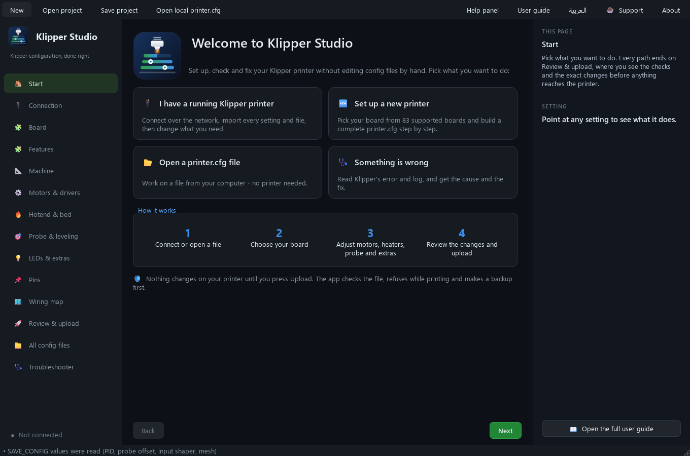
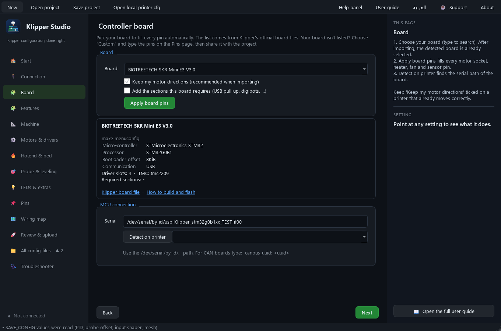
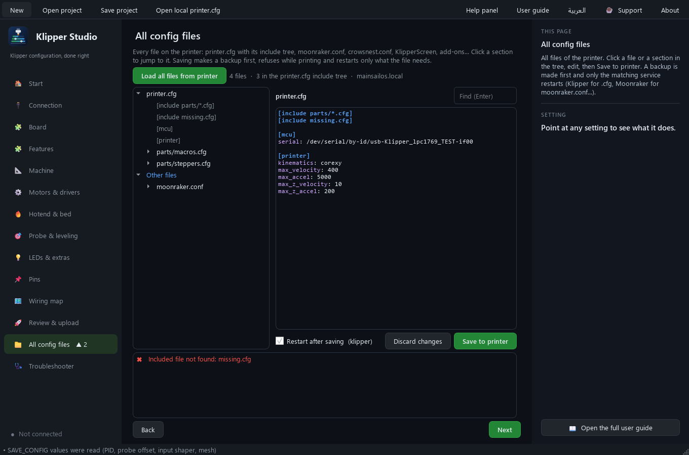
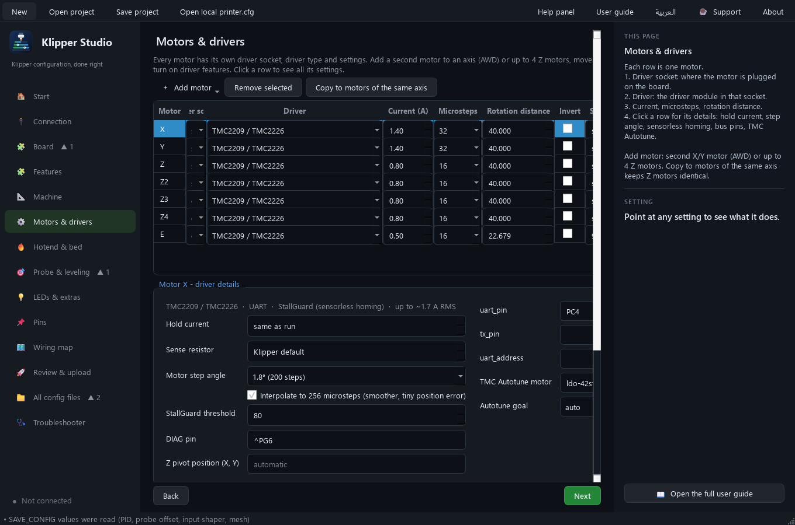
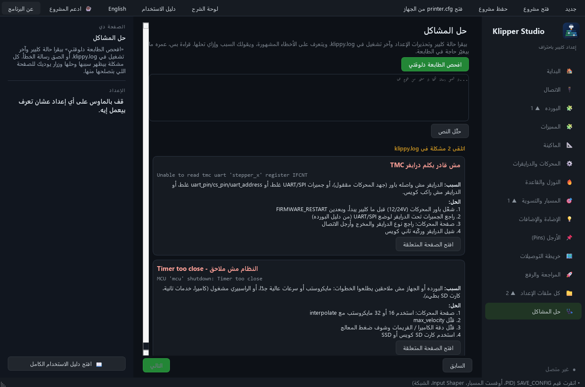
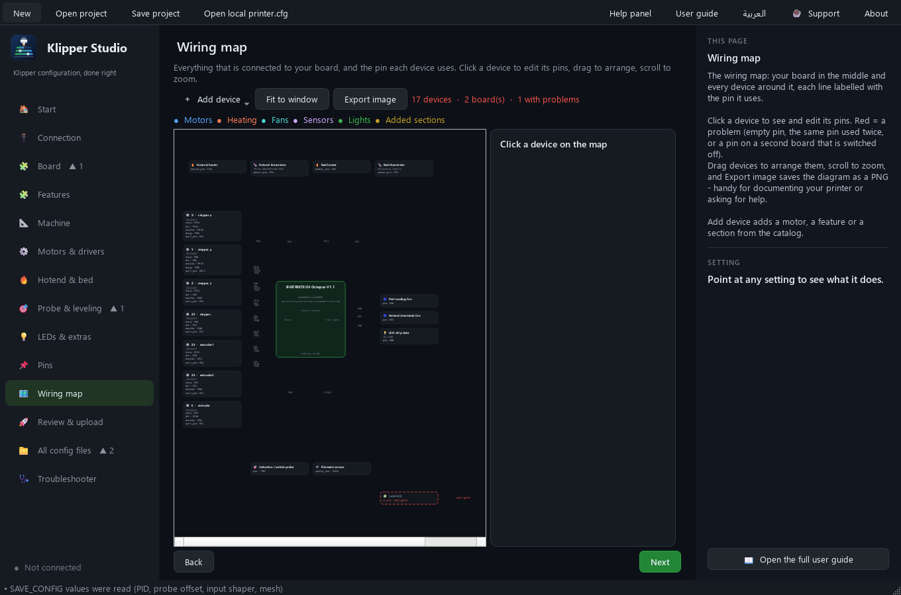
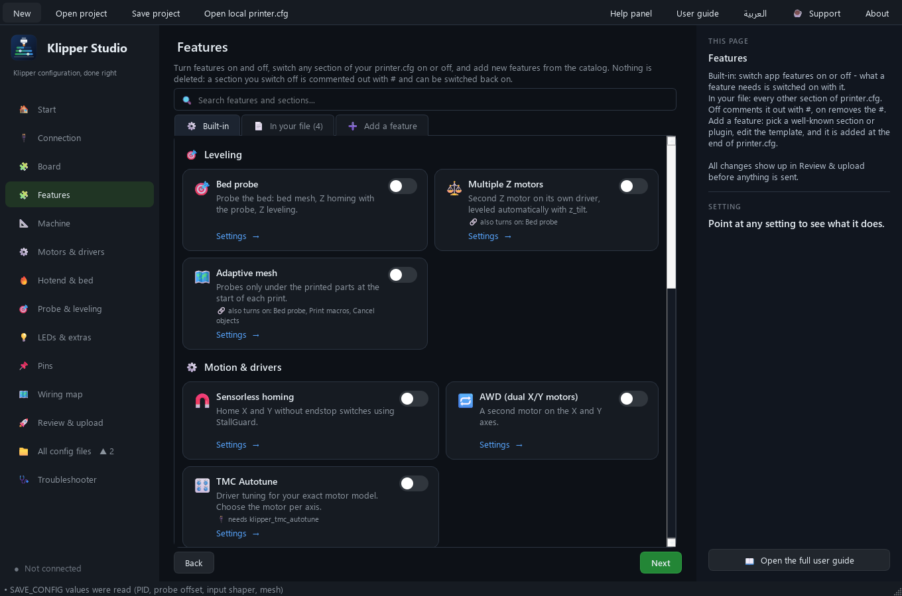
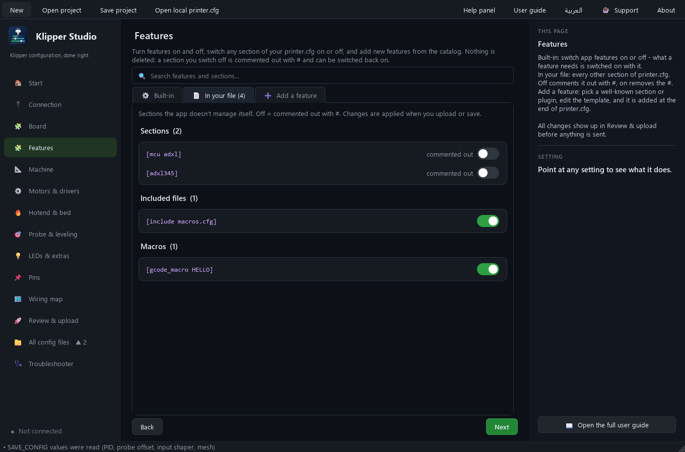

<div align="center">


# ATGENX Klipper Studio

**A desktop app that builds, checks and safely uploads your Klipper `printer.cfg`, without breaking what you already have.**


[](https://buymeacoffee.com/seifemadatv)

[العربية](README.ar.md) · [User guide](docs/GUIDE.md) · [Supported boards](docs/BOARDS.md) · [Contributing](CONTRIBUTING.md) · [Changelog](CHANGELOG.md)



</div>

> **Beta:** it works on real printers, but always read the *Differences* tab before uploading.
> Every upload makes a backup first, and the app refuses to touch a printer that is printing.

## Why

Editing `printer.cfg` by hand means copying pins from a board file, remembering which section overrides which,
and hoping `SAVE_CONFIG` doesn't silently win over the value you just changed. One typo and Klipper won't start.

Klipper Studio walks you through the machine page by page, generates the config for your board, **merges it into
your existing file line by line** (your macros, comments and formatting stay), shows you exactly what changes,
checks the common mistakes, and uploads it through Moonraker with a backup.

## Features

- **83 controller boards.** BIGTREETECH, FYSETC, Makerbase, Mellow, Creality, Duet, LDO, Prusa, RAMPS and more,
  imported from Klipper's official board files. Pick yours and every pin, TMC UART/SPI bus and required section
  is filled in. You also get a *make menuconfig* summary (processor, bootloader, clock, interface).
- **Import from a running printer.** Connects to Moonraker (no SSH, no passwords), downloads `printer.cfg`
  **and every file it includes**, reads the `SAVE_CONFIG` values (PID, probe offset, input shaper), and recognises your board from the pins.
- **Smart merge.**
  - Only values that actually change are rewritten. Everything else keeps its exact line, inline comment and number format.
  - Your own keys, macros and add-on sections are left alone.
  - Values the app now writes are removed from the `SAVE_CONFIG` block, so they really take effect.
- **Checks before upload.** Missing or duplicated pins, placeholder serial, `max_z_accel > max_accel`, empty mesh area, a wrong TMC bus for the board,
  macros that reference features you turned off, sections duplicated in included files, and Klipper's own config warnings.
- **Safe upload.**
  - Refuses while printing or paused.
  - Refuses if the file changed on the printer since you loaded it.
  - Makes a backup on the printer and on your computer before uploading.
  - Runs `FIRMWARE_RESTART`, waits for Klipper, and gives you one-click restore.
- **All config files.** Browse every file on the printer as an include tree: `moonraker.conf`, `crowsnest.conf`,
  KlipperScreen, add-ons. Click a section to jump to it, edit and save with the same safety rules. Only the
  service the file needs is restarted.
- **Motors & drivers manager.** Every motor on its own driver socket with its own driver and settings: current,
  microsteps, 0.9°/1.8° motors, stealthChop/spreadCycle, interpolation, sense resistor. Add X2/Y2 (AWD) or up to 4 Z
  motors, mix TMC2209/2208/2130/5160/2240/2660 drivers, turn on **sensorless homing** and **TMC Autotune** (203 motors).
- **Troubleshooter.** Reads Klipper's state and `klippy.log` and explains 31 common problems (Timer too close, TMC UART
  errors, ADC out of range, heater rate, endstops, probes, unknown options...) with the cause and the fix.
- **Covers the full machine.** Cartesian and CoreXY, `z_tilt` for 2-4 Z motors or `quad_gantry_level`, inductive probe,
  BLTouch or endstop, bed mesh, input shaper for X/Y/Z, filament sensor, NeoPixel with live heater and progress gauges,
  firmware retraction, temperature sensors, optional START_PRINT/END_PRINT/M600 macros with adaptive mesh.
- **Features you switch on and off.** A switch per feature (dependencies are switched on with it), a switch for
  every section of your own file (off = commented out with `#`, never deleted), and a catalog of 22 more sections
  and plugins to add - ADXL345, Shake&Tune, Mainsail macros, skew correction, chamber fan, case light and more.
- **Wiring map.** Your board in the middle and every device around it, each line labelled with its pin: motors and
  their driver sockets, heaters, thermistors, fans, probe, LEDs, plus sections you added and any second board
  (Pico, toolhead). Red marks empty pins, pins used twice, or pins on a board that is switched off. Click a device
  to edit its pins, and export the whole diagram as a PNG.
- **It explains itself.** A help panel shows what every setting does, typical values and where it lands in
  printer.cfg; the generated file gets a heading per group and an explanation per section; and there is a full
  [user guide](docs/GUIDE.md).
- **English and Arabic** (right-to-left) interface, switchable at any time.
- **Command line** for automation and CI: `python -m studio check printer.cfg`.

## Screenshots

| Board | All config files |
|---|---|
|  |  |
| **Motors & drivers** | **Troubleshooter (Arabic UI)** |
|  |  |
| **Wiring map** | **Features** |
|  |  |
| **Switch any section of your file** | **All config files** |
|  |  |

## Install

Requires **Python 3.9+** on Windows, Linux or macOS.

```bash
git clone https://github.com/ARDUTECH0/ATGENX-Klipper-Studio.git
cd ATGENX-Klipper-Studio
pip install -r requirements.txt
python -m studio
```

Windows: double-click `run.bat`. Linux/macOS: `./run.sh`.

## Quick start

1. **Connection:** enter your printer address (`192.168.1.50` or `mainsailos.local`) and click **Import from printer**.
2. **Board:** check the detected board, or pick one and click **Apply board pins**.
3. Walk through **Machine → Motors → Hotend & bed → Probe → LEDs & extras**.
4. **Review & upload:** read *Checks* and *Differences*, then **Upload and restart**.

No printer yet? Build a config from scratch, save it with **Save to computer**, or use **Save project** to keep your settings as a `.studio.json` file.

> Moonraker must allow your computer: add its network to `trusted_clients` in `moonraker.conf`, or enter an API key.

## Command line

```bash
python -m studio boards --mcu stm32f446          # boards using an MCU
python -m studio check printer.cfg --out result  # import + merge + validate, writes result/printer.merge.cfg
python -m studio generate my.studio.json -o printer.cfg --base printer.cfg
python -m studio doctor klippy.log               # explain the errors in a Klipper log
python -m studio --lang ar                       # start the app in Arabic
```

## How the merge works

| In your current file | What happens |
|---|---|
| A value the app manages, unchanged | Line kept exactly (comment and formatting included) |
| A value the app manages, changed | Line replaced |
| A key the app doesn't know | Kept |
| A default such as `homing_speed` or `off_below` | Your value wins; defaults only go into new sections |
| A feature you switched off (for example the LED strip) | Its sections are removed, comments above them kept |
| Macros, `[include]`, add-ons | Untouched |
| `SAVE_CONFIG` | Values now in the main file are removed from it; bed meshes stay |

## Roadmap

- Delta and other kinematics
- Multiple extruders and toolchangers, CAN toolhead boards
- Guided sensorless tuning, PID, `SHAPER_CALIBRATE` and pressure advance calibration
- Firmware build helper (generates the `make menuconfig` `.config`)
- Packaged installers for Windows, macOS and Linux

Ideas and votes are welcome in [Issues](../../issues).

## Contributing

Pull requests are welcome, especially **new or corrected boards**, translations and printer profiles.
Every change is reviewed by the maintainer before it is merged. See [CONTRIBUTING.md](CONTRIBUTING.md).

## Support

If Klipper Studio saved you time:

- ⭐ **Star the repository.** It helps other makers find it.
- Share it in your 3D printing groups.
- Report your board working (or not) in [Issues](../../issues).
- ☕ **[Buy me a coffee](https://buymeacoffee.com/seifemadatv)** to keep new features and boards coming.

## License

[PolyForm Noncommercial 1.0.0](LICENSE). **Free for personal, hobby, educational and other noncommercial use**,
including modifying it and sharing your changes under the same terms.
**Selling it, bundling it with a paid product or using it commercially is not allowed** without written permission
from the author. For commercial licensing, open an issue.

This is a *source-available* license, not an OSI-approved open source license.

## Credits

- [Klipper](https://github.com/Klipper3d/klipper) by Kevin O'Connor and contributors. Board pin data is derived from Klipper's `config/generic-*.cfg` files (GPLv3). Klipper Studio is an independent project and is not affiliated with Klipper.
- [klipper-led_effect](https://github.com/julianschill/klipper-led_effect) by Julian Schill, used for the LED gauges.
- [Moonraker](https://github.com/Arksine/moonraker) by Arksine.

*Klipper Studio changes your printer configuration. Review the result before uploading. You are responsible for your machine.*
